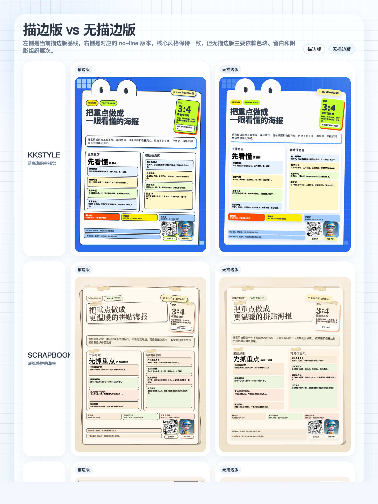
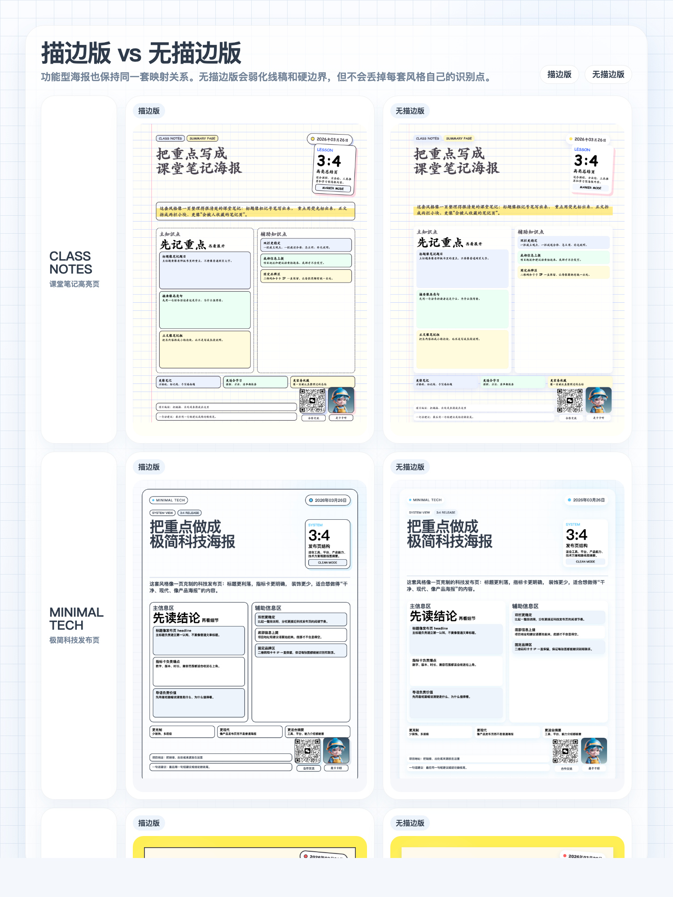

# kkstyle-skills

Reusable agent skills for turning text into playful information cards and posters with fixed date chips, fixed contact QR blocks, fixed Kaka IP slots, and screenshot-ready HTML. The repository now includes both outline-led styles and matching no-line variants.

## Included Skills

- [`skills/kkstyle-card-screenshot`](./skills/kkstyle-card-screenshot)
- [`skills/kkstyle-scrapbook-screenshot`](./skills/kkstyle-scrapbook-screenshot)
- [`skills/kkstyle-editorial-screenshot`](./skills/kkstyle-editorial-screenshot)
- [`skills/kkstyle-retro-pixel-screenshot`](./skills/kkstyle-retro-pixel-screenshot)
- [`skills/kkstyle-class-notes-screenshot`](./skills/kkstyle-class-notes-screenshot)
- [`skills/kkstyle-minimal-tech-screenshot`](./skills/kkstyle-minimal-tech-screenshot)
- [`skills/kkstyle-poster-comic-screenshot`](./skills/kkstyle-poster-comic-screenshot)
- [`skills/kkstyle-diagram-board-screenshot`](./skills/kkstyle-diagram-board-screenshot)
- [`skills/kkstyle-card-noline-screenshot`](./skills/kkstyle-card-noline-screenshot)
- [`skills/kkstyle-scrapbook-noline-screenshot`](./skills/kkstyle-scrapbook-noline-screenshot)
- [`skills/kkstyle-editorial-noline-screenshot`](./skills/kkstyle-editorial-noline-screenshot)
- [`skills/kkstyle-retro-pixel-noline-screenshot`](./skills/kkstyle-retro-pixel-noline-screenshot)
- [`skills/kkstyle-class-notes-noline-screenshot`](./skills/kkstyle-class-notes-noline-screenshot)
- [`skills/kkstyle-minimal-tech-noline-screenshot`](./skills/kkstyle-minimal-tech-noline-screenshot)
- [`skills/kkstyle-poster-comic-noline-screenshot`](./skills/kkstyle-poster-comic-noline-screenshot)
- [`skills/kkstyle-diagram-board-noline-screenshot`](./skills/kkstyle-diagram-board-noline-screenshot)

## Package Layout

Install the whole skill directory, not a single file:

- `SKILL.md`
- `agents/`
- `references/`
- `scripts/`
- `assets/`

## Outline Vs No-Line

Each of the eight base styles now has a matching `noline` variant.
The left column below is the current outline-led version, and the right column is the matching no-line version with softer boundaries, lighter separation, and no visible black stroke treatment.

### Core Styles

### Specialized Styles

## Example Prompts

- `Use $kkstyle-card-screenshot to turn these notes into a 3:4 card in the kkstyle look.`
- `Use $kkstyle-card-screenshot and give me the HTML only.`
- `Use $kkstyle-card-screenshot to generate both the card HTML and a PNG.`
- `Use $kkstyle-card-screenshot to make a 3:4 poster with the default date chip, contact QR, and Kaka IP slot.`
- `Use $kkstyle-scrapbook-screenshot to turn these notes into a warm paper-collage 3:4 poster.`
- `Use $kkstyle-editorial-screenshot to turn these notes into a clean editorial 3:4 poster.`
- `Use $kkstyle-retro-pixel-screenshot to turn these notes into a retro handheld-style 3:4 poster.`
- `Use $kkstyle-class-notes-screenshot to turn these notes into a handwritten class-notes 3:4 poster.`
- `Use $kkstyle-minimal-tech-screenshot to turn these notes into a minimal tech 3:4 poster.`
- `Use $kkstyle-poster-comic-screenshot to turn these notes into a comic poster 3:4 layout.`
- `Use $kkstyle-diagram-board-screenshot to turn these notes into a diagram-board 3:4 explainer poster.`
- `Use $kkstyle-card-noline-screenshot to turn these notes into a no-line blue seal-style 3:4 poster.`
- `Use $kkstyle-scrapbook-noline-screenshot to turn these notes into a no-line warm scrapbook 3:4 poster.`
- `Use $kkstyle-editorial-noline-screenshot to turn these notes into a no-line editorial 3:4 poster.`
- `Use $kkstyle-retro-pixel-noline-screenshot to turn these notes into a no-line retro-pixel 3:4 poster.`
- `Use $kkstyle-class-notes-noline-screenshot to turn these notes into a no-line handwritten class-notes 3:4 poster.`
- `Use $kkstyle-minimal-tech-noline-screenshot to turn these notes into a no-line minimal-tech 3:4 poster.`
- `Use $kkstyle-poster-comic-noline-screenshot to turn these notes into a no-line comic poster 3:4 layout.`
- `Use $kkstyle-diagram-board-noline-screenshot to turn these notes into a no-line diagram-board 3:4 explainer poster.`
