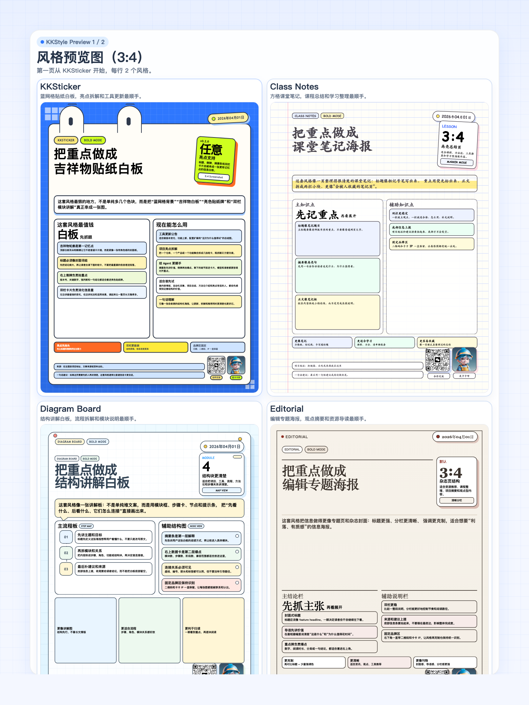
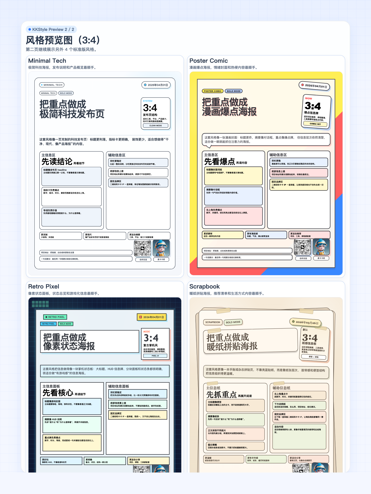

# KKStyle Skills

`kkstyle-skills` 是一个面向支持 skill 的 agent 环境的海报技能集合仓库。它把文章、笔记、课程摘要、项目说明或推荐清单，转换成固定比例的 HTML 海报，并可继续截图导出为 PNG。

当前仓库包含 `8` 个风格家族、共 `16` 个技能目录。每种风格都提供：

- 标准版 `*-screenshot`
- 柔和版 `*-noline-screenshot`

它们共享一致的工作方式、固定品牌区和截图脚本，但在视觉语言上各自独立，适合不同类型的内容表达。

## 项目特点

- `HTML first`：默认先生成完整 HTML，需要时再截图导出 PNG。
- `固定画布`：默认主比例是 `3:4`，同时支持 `4:3`、`1:1`、`16:9`、`9:16`。
- `风格成套`：每个风格都带模板、设计规则、截图脚本和 agent 元信息。
- `品牌统一`：默认包含顶部日期标签、右下角 `合作交流` 二维码和 `是卡卡呀` IP 位。
- `适合结构化输入`：尤其适合标题、摘要、分点、模块、步骤、资源清单这类内容。

## Claude Code 使用

这个仓库现在已经按 Claude Code 的技能目录习惯做了适配：

- 仓库内会提供 `.claude/skills/` 项目技能入口，打开这个仓库时即可直接看到 `/kkstyle-*` 命令。
- 仓库还额外提供了一个完整的 Claude Code plugin 和本地 marketplace，适合分发、安装和版本化管理。
- 顶层 `kkstyle-*` 目录仍然是技能的主维护位置，`.claude/skills/*` 只负责 Claude Code 发现。
- 所有技能都改成了 `manual-first`：在 Claude Code 里通过 `/kkstyle-...` 显式调用，不会在无关会话里自动触发。
- 技能里的脚本和素材路径统一改成 `${CLAUDE_SKILL_DIR}`，装到 `~/.claude/skills` 后也能正确找到自带文件。
- 每个技能都带 `examples.md`，Claude 需要更具体的调用样例时可以按需加载，不必把全部示例塞进主技能文件。

如果你想把这套技能装到个人 Claude Code 目录，直接运行：

```bash
./scripts/install_claude_skills.sh
```

如果你想刷新当前仓库下的项目技能入口，运行：

```bash
./scripts/install_claude_skills.sh --target ./.claude/skills --mode link --force
```

如果你改过技能内容，建议顺手跑一次校验：

```bash
./scripts/validate_claude_skills.sh
```

## Claude Code Plugin

仓库里已经包含一个可直接使用的 Claude Code plugin 源码目录：

- plugin 源码目录：[plugins/kkstyle](/Users/bytedance/Downloads/kkstyle-skills/plugins/kkstyle)
- marketplace 目录：[.claude-plugin/marketplace.json](/Users/bytedance/Downloads/kkstyle-skills/.claude-plugin/marketplace.json)

### 本地测试 plugin

```bash
claude --plugin-dir ./plugins/kkstyle
```

在 Claude Code 里调用时，命令会带 plugin namespace，例如：

```text
/kkstyle:kkstyle-diagram-board-screenshot 主题：Agent 工作流说明；结构：1. 输入 2. 处理 3. 输出
```

### 通过仓库内置 marketplace 安装

```text
/plugin marketplace add /absolute/path/to/kkstyle-skills
/plugin install kkstyle@kkstyle-marketplace
```

### 同步与打包

当你新增或删除顶层 `kkstyle-*` skill 后，先同步 plugin 里的 `skills/`：

```bash
./scripts/sync_claude_plugin.sh
```

要生成一个可直接分享的 marketplace bundle：

```bash
./scripts/build_claude_marketplace.sh
```

默认会输出到 `dist/kkstyle-marketplace/`。

如果你要检查 plugin 和 marketplace 结构：

```bash
./scripts/validate_claude_plugin.sh
```

## 风格预览（3:4）




为了把预览图完整展示出来，这里拆成了两张 `3:4` 预览图。两张图都使用统一的示例标题和标签基准，第一张从 `KKSticker` 开始。

## 风格总览

| 风格 | 标准版 | `noline` 版 | 更适合的内容 |
| --- | --- | --- | --- |
| KKSticker | [kkstyle-kksticker-screenshot](./kkstyle-kksticker-screenshot) | [kkstyle-kksticker-noline-screenshot](./kkstyle-kksticker-noline-screenshot) | 蓝网格贴纸白板、工具更新、亮点拆解、双栏讲解 |
| Class Notes | [kkstyle-class-notes-screenshot](./kkstyle-class-notes-screenshot) | [kkstyle-class-notes-noline-screenshot](./kkstyle-class-notes-noline-screenshot) | 课堂笔记、课程总结、学习资源、知识点整理 |
| Diagram Board | [kkstyle-diagram-board-screenshot](./kkstyle-diagram-board-screenshot) | [kkstyle-diagram-board-noline-screenshot](./kkstyle-diagram-board-noline-screenshot) | 流程讲解、模块拆解、结构说明、工作流总结 |
| Editorial | [kkstyle-editorial-screenshot](./kkstyle-editorial-screenshot) | [kkstyle-editorial-noline-screenshot](./kkstyle-editorial-noline-screenshot) | 杂志封面感摘要、观点表达、信息密集型导读 |
| Minimal Tech | [kkstyle-minimal-tech-screenshot](./kkstyle-minimal-tech-screenshot) | [kkstyle-minimal-tech-noline-screenshot](./kkstyle-minimal-tech-noline-screenshot) | 产品发布、技术介绍、keynote 风摘要、极简科技视觉 |
| Poster Comic | [kkstyle-poster-comic-screenshot](./kkstyle-poster-comic-screenshot) | [kkstyle-poster-comic-noline-screenshot](./kkstyle-poster-comic-noline-screenshot) | 漫画海报、强情绪封面、pop-art 信息卡 |
| Retro Pixel | [kkstyle-retro-pixel-screenshot](./kkstyle-retro-pixel-screenshot) | [kkstyle-retro-pixel-noline-screenshot](./kkstyle-retro-pixel-noline-screenshot) | 游戏 HUD、像素状态板、掌机风介绍页 |
| Scrapbook | [kkstyle-scrapbook-screenshot](./kkstyle-scrapbook-screenshot) | [kkstyle-scrapbook-noline-screenshot](./kkstyle-scrapbook-noline-screenshot) | 暖纸拼贴、资源推荐、手账感摘要、生活方式内容 |

## 标准版和 `noline` 的区别

- `*-screenshot`：边框、描边、卡片分隔和结构边界更明确，视觉风格更强。
- `*-noline-screenshot`：减少粗黑描边，更多依靠留白、阴影、轻分隔和色块建立层级，整体更柔和。

如果你希望画面更“海报化”“风格化”，优先选标准版；如果你希望更干净、更轻、更不压内容，优先选 `noline` 版。

## 快速使用

### 1. 在 agent 中调用某个 skill

```text
Use $kkstyle-diagram-board-screenshot to turn these notes into a 3:4 explainer poster. Return the full HTML first, then render a PNG.
```

```text
Use $kkstyle-scrapbook-noline-screenshot to make this feel like a warm scrapbook poster with softer boundaries.
```

```text
Use $kkstyle-kksticker-screenshot to turn these notes into a kksticker 3:4 poster with a mascot-like whiteboard silhouette, a top date sticker, and a bold highlight side card.
```

### 2. 推荐输入格式

```text
主题：
核心结论：
结构：
1. ...
2. ...
3. ...
项目地址/来源：
一句话建议：
日期：
```

大多数 skill 的默认输出契约都比较一致：

1. 先用一句话判断内容密度或适配的版式类型。
2. 输出完整 HTML。
3. 如果用户要求图片，再补充截图说明或直接渲染 PNG。

在 Claude Code 里，也可以直接用 slash command：

```text
/kkstyle-diagram-board-screenshot 主题：Agent 工作流说明；结构：1. 输入 2. 处理 3. 输出
```

```text
/kkstyle-kksticker-screenshot 主题：这次更新最值钱的点；结构：1. 变化亮点 2. 现在能怎么玩 3. 适合谁先试
```

## 本地截图导出

每个技能目录都带有同名脚本接口：

```bash
cd kkstyle-diagram-board-screenshot
./scripts/capture_card.sh input.html output.png 3:4
```

支持的比例与画布尺寸：

| Ratio | Canvas size |
| --- | --- |
| `3:4` | `1500 x 2000` |
| `4:3` | `2000 x 1500` |
| `1:1` | `1800 x 1800` |
| `16:9` | `1920 x 1080` |
| `9:16` | `1080 x 1920` |

截图脚本会自动查找这些浏览器二进制之一：

- `google-chrome`
- `chromium`
- `chromium-browser`
- `chrome`
- `/Applications/Google Chrome.app/Contents/MacOS/Google Chrome`

如果 HTML 里的图片需要内联，可以用：

```bash
./scripts/image_to_data_uri.py assets/kk-character.jpeg
```

## 仓库结构

所有技能目录都遵循同一套组织方式：

```text
.claude/
└── skills/
    └── <skill-name> -> ../../kkstyle-<style>-screenshot
.claude-plugin/
└── marketplace.json
plugins/
└── kkstyle/
    ├── .claude-plugin/
    │   └── plugin.json
    ├── README.md
    ├── CHANGELOG.md
    └── skills/
        └── <skill-name> -> ../../../kkstyle-<style>-screenshot
kkstyle-<style>-screenshot/
├── SKILL.md
├── agents/
│   └── openai.yaml
├── assets/
│   ├── <style>-card-template.html
│   ├── contact-code.png
│   └── kk-character.jpeg
├── references/
│   ├── <style>-design-rules.md
│   └── layout-presets.md
└── scripts/
    ├── capture_card.sh
    └── image_to_data_uri.py
```

其中：

- 顶层 `kkstyle-*` 目录是技能源码。
- `.claude/skills/*` 是给 Claude Code 自动发现用的项目级入口。

通用技能目录内部结构如下：

```text
kkstyle-<style>-screenshot/
├── SKILL.md
├── agents/
│   └── openai.yaml
├── assets/
│   ├── <style>-card-template.html
│   ├── contact-code.png
│   └── kk-character.jpeg
├── references/
│   ├── <style>-design-rules.md
│   └── layout-presets.md
└── scripts/
    ├── capture_card.sh
    └── image_to_data_uri.py
```

各目录职责如下：

- `SKILL.md`：skill 的主行为定义，包括适用场景、工作流、输出契约和失败检查。
- `agents/openai.yaml`：展示名、简介和默认 prompt 等 UI 元信息。
- `assets/`：基础 HTML 模板与固定品牌素材。
- `references/`：风格规则和比例尺寸说明。
- `scripts/`：截图脚本与图片内联工具。
- `scripts/install_claude_skills.sh`：把整套技能安装到 Claude Code 的项目目录或个人目录。
- `examples.md`：Claude Code 可按需加载的调用示例和改稿示例。
- `scripts/validate_claude_skills.sh`：检查技能目录、Claude Code frontmatter 和路径引用是否完整。
- `plugins/kkstyle/`：Claude Code plugin 源码目录，可直接用 `claude --plugin-dir` 测试。
- `.claude-plugin/marketplace.json`：Claude Code marketplace 入口，支持 `/plugin marketplace add`。
- `scripts/sync_claude_plugin.sh`：同步 plugin 下的 `skills/` 目录。
- `scripts/build_claude_marketplace.sh`：打包自包含的 marketplace 分发目录。
- `scripts/validate_claude_plugin.sh`：检查 plugin 和 marketplace 结构是否完整。

## 维护建议

- 要改 agent 的默认行为，优先修改对应目录下的 `SKILL.md`。
- 要改展示名称或默认 prompt，修改 `agents/openai.yaml`。
- 要改视觉样式，优先调整 `assets/*-card-template.html`，必要时同步 `references/*-design-rules.md`。
- 要扩展新比例或截图行为，修改 `scripts/capture_card.sh` 和 `references/layout-presets.md`。
- 要让 Claude Code 发现新增技能，新增目录后运行 `./scripts/install_claude_skills.sh --target ./.claude/skills --mode link --force`。
- 要检查 Claude Code 兼容性和资源完整性，运行 `./scripts/validate_claude_skills.sh`。
- 要同步 plugin skills，运行 `./scripts/sync_claude_plugin.sh`。
- 要检查 plugin 和 marketplace，运行 `./scripts/validate_claude_plugin.sh`。

## 依赖

- Chrome / Chromium 之一
- `bash`
- `python3` 用于 `image_to_data_uri.py`

如果你想继续补全这个仓库，比较自然的下一步通常是：

- 给每个风格都补一份面向人类读者的 `README.md`
- 增加统一的示例输入 / 输出截图
- 在根目录补一份风格选型示意图
